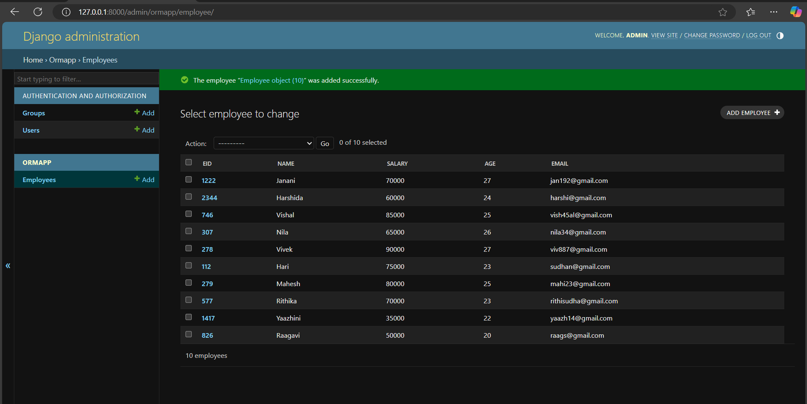

# Ex02 Django ORM Web Application
# Date:14.10.2024
# AIM
To develop a Django application to store and retrieve data from a bank loan database using Object Relational Mapping(ORM).

# ENTITY RELATIONSHIP DIAGRAM


## DESIGN STEPS
## STEP 1:
Clone the problem from GitHub

## STEP 2:
Create a new app in Django project

## STEP 3:
Enter the code for admin.py and models.py

## STEP 4:
Execute Django admin and create details for 10 books

# PROGRAM
```
admin.py

from django.contrib import admin
from .models import Employee,EmployeeAdmin
admin.site.register(Employee,EmployeeAdmin)

models.py

from django.db import models
from django.contrib import admin
class Employee (models.Model):
    eid=models.CharField(max_length=20,help_text="Employee ID")
    name=models.CharField(max_length=100)
    salary=models.IntegerField()
    age=models.IntegerField()
    email=models.EmailField()

class EmployeeAdmin(admin.ModelAdmin):
    list_display=('eid','name','salary','age','email')

```
# OUTPUT




# RESULT
Thus the program for creating a database using ORM hass been executed successfully
